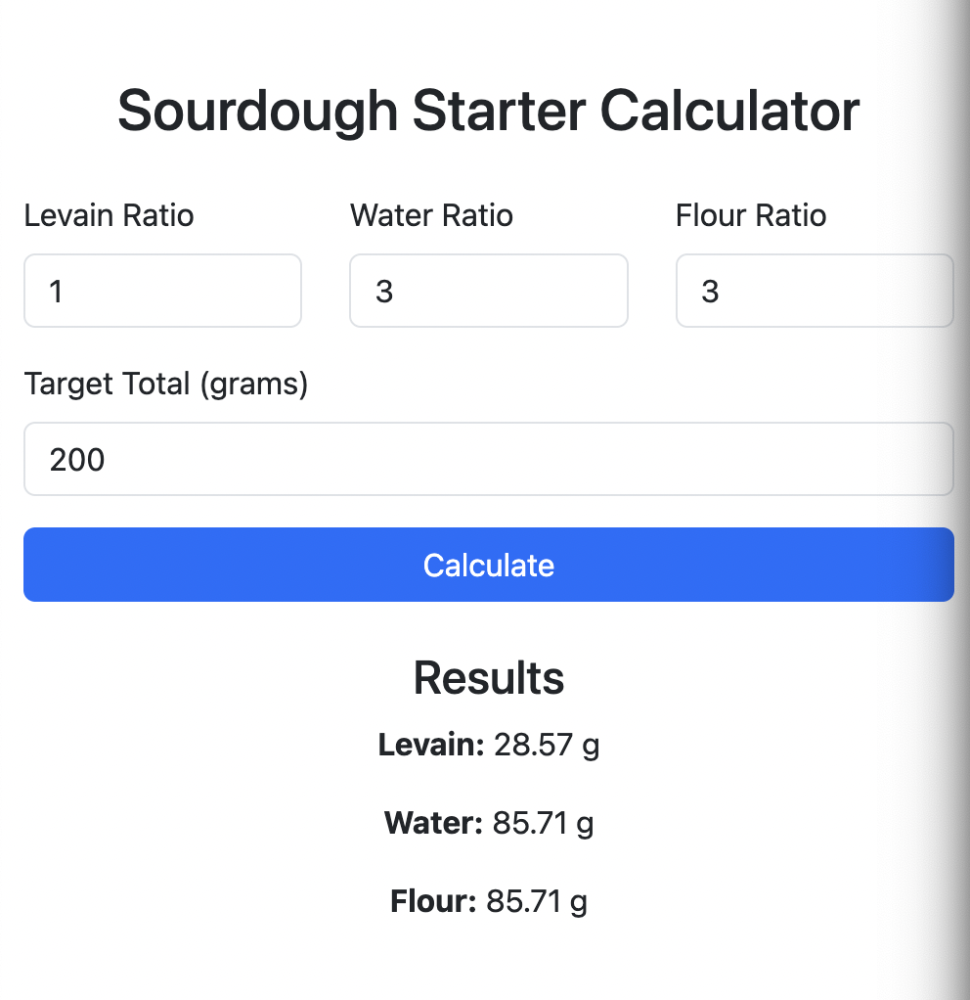

# Sourdough Feed Calculator

A simple web-based tool to calculate the required quantities of levain, water, and flour for your sourdough starter while maintaining custom ingredient ratios.

## Features
- Enter your desired ratios for levain, water, and flour.
- Specify the total target weight (e.g., 300g).
- The app calculates the exact amounts of each ingredient based on the input ratios.

## Technologies
- **HTML**: Structure of the webpage.
- **Bootstrap 5**: For responsive and user-friendly styling.
- **JavaScript**: For client-side calculations and dynamic rendering.

## How to Use
1. Clone the repository:
   ```bash
   git clone https://github.com/your-username/sourdough-starter-calculator.git
   ```
2. Open the `index.html` file in your browser.
3. Enter:
   - The ratio for `levain`, `water`, and `flour`.
   - The total target weight (e.g., 300g).
4. Click **Calculate** to see results for each ingredient.

## Example
If your input is:
- Levain Ratio: `1`
- Water Ratio: `2`
- Flour Ratio: `3`
- Target Weight: `300g`

The output will be:
- Levain: **50g**
- Water: **100g**
- Flour: **150g**

## Screenshot
 <!-- Add a screenshot of your app -->

## License
This project is licensed under the MIT License. See the [LICENSE](LICENSE) file for details.

---

Enjoy making your sourdough starter! 😊

## License
This project is licensed under the [Creative Commons Attribution 4.0 International (CC BY 4.0)](LICENSE) license.